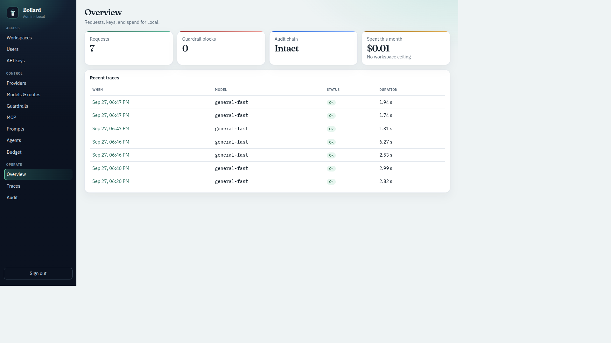
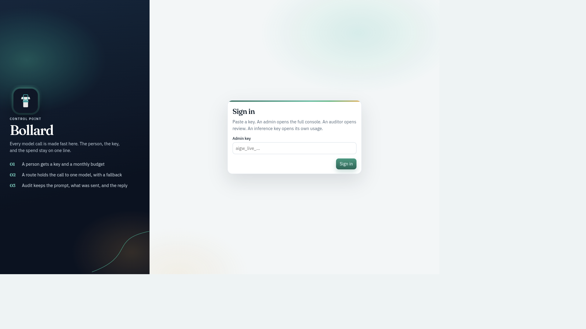
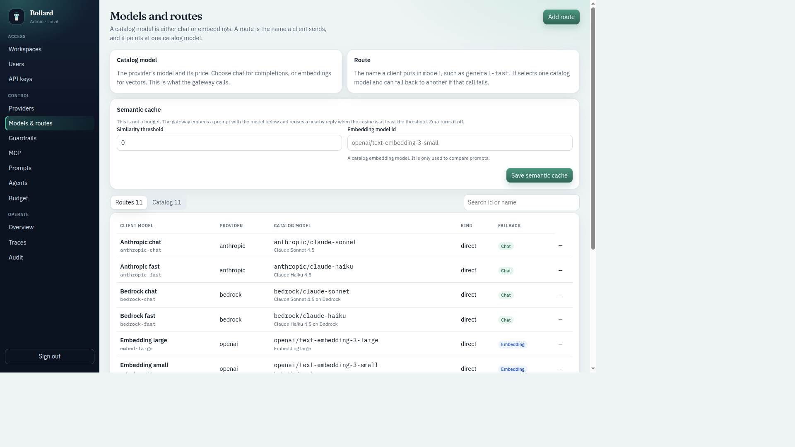
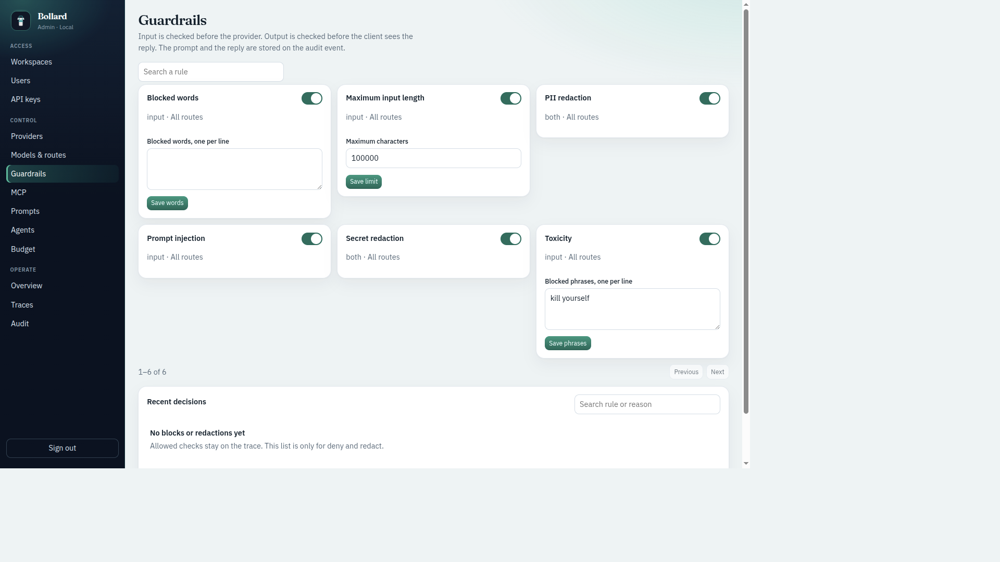
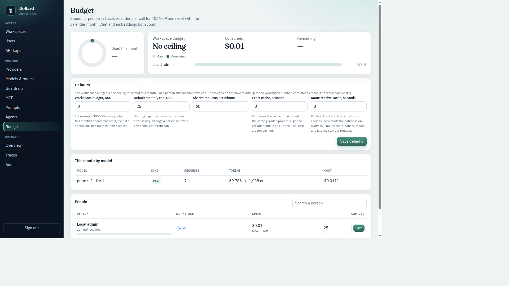

# Bollard

[](https://github.com/dnanatihor/bollard/actions/workflows/ci.yml)
[](https://www.python.org/)
[](https://docs.docker.com/compose/)
[](LICENSE)

Applications call Bollard. You manage providers, routes, keys, guardrails, budgets, audit, and traces in the console.

The API is Python. The console is React. Docker runs both in one container with PostgreSQL and Redis.



## What the console covers

- **Workspaces** — switch the tenant an admin is operating
- **Users and API keys** — create a person, issue a key that is allowed until a date, then rotate or revoke it
- **Providers** — OpenAI, Anthropic, Gemini, Azure OpenAI, Bedrock, or an OpenAI-compatible host
- **Models and routes** — the name a client sends, the catalog model behind it, a fallback, and the semantic cache
- **Guardrails** — check input before the provider and output before the client
- **MCP and agents** — register a tool server and let a chat model call its tools
- **Budget** — a monthly cap for each person, and a separate workspace ceiling for the month
- **Traces** — the operational timeline of a call
- **Audit** — the prompt, the payload sent, and the reply, in a hash chain

## Console

Sign in with the admin key created on first run.



Routes name the model a client sends. The catalog is what Bollard calls.



Guardrails run on the way in and on the way out.



The workspace ceiling is its own number. Personal caps do not have to add up to it. Zero means there is no workspace ceiling.



## Run

| How you want to run | Command | Open |
| --- | --- | --- |
| Docker | `make up` | http://127.0.0.1:8080 |
| On this machine, with reload | `make dev` | http://127.0.0.1:5173 |

Copy `.env.example` to `.env` and set the pepper, master key, and database passwords before the first admin key. `make down` stops Docker and keeps the database volumes. Setup, environment variables, and the request path are in [DEPLOY.md](DEPLOY.md).

## Call Bollard

```bash
curl -sS http://127.0.0.1:8080/v1/chat/completions \
  -H "Authorization: Bearer $GATEWAY_API_KEY" \
  -H "content-type: application/json" \
  -d '{"model":"general-fast","messages":[{"role":"user","content":"Hello"}]}'
```

`$GATEWAY_API_KEY` is a key from the console. Response headers `x-request-id` and `x-trace-id` match the audit event and the trace.

## Tests

```bash
poetry -C backend run pytest -q
```

Tests use a temporary SQLite file. Set `GATEWAY_TEST_DATABASE_URL` only for a database you can wipe. Continuous integration runs the same suite on SQLite and PostgreSQL, then builds the console.

## Layout

```text
backend/gateway     FastAPI service and request pipeline
backend/alembic    Schema created on first startup
frontend/src       React console
docs/               Architecture and console screenshots
docker-compose.yml PostgreSQL 16, Redis, and Bollard
```

How the request moves through the process is in [docs/architecture.md](docs/architecture.md).

## License

[PolyForm Noncommercial License 1.0.0](LICENSE). Personal use and noncommercial organizations are covered. Commercial use needs permission from the copyright holder.
